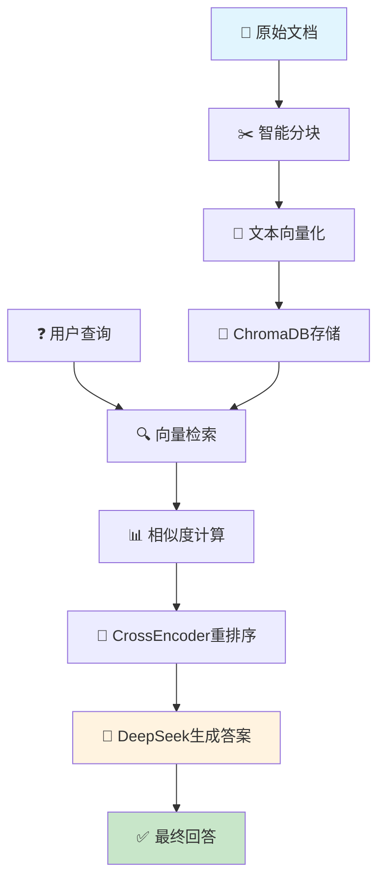

# 🚀 从零到一：Python构建企业级RAG系统完整实战指南（附完整源码）

> **🔥 热门技术栈**：ChromaDB + DeepSeek + SentenceTransformers + CrossEncoder  
> **📊 适合人群**：Python开发者、AI工程师、后端开发、技术架构师  
> **⭐ GitHub仓库**：[https://github.com/wangzhengyi/AICode](https://github.com/wangzhengyi/AICode) （欢迎Star⭐）

## 🎯 项目亮点

本文将带你**从零开始**构建一个**生产级RAG系统**，不仅有完整的技术原理解析，更有**可直接运行的完整代码**！

**🔥 你将学到：**
- ✅ RAG系统完整技术架构设计
- ✅ ChromaDB向量数据库实战应用
- ✅ 中文语义检索最佳实践
- ✅ DeepSeek大模型集成方案
- ✅ 企业级部署和性能优化
- ✅ 完整源码 + 详细注释


该项目展示了如何使用Python构建一个**完整的企业级RAG系统**，涵盖了从文档处理、向量化、存储到检索和生成的**全流程实现**。

## 🐍 Python快速上手指南（Java/Kotlin开发者专享）

> **💡 提示**：如果你熟悉Java或Kotlin，这个对比表将帮你快速掌握Python核心语法！

### 📊 核心语法对比速查表

| 功能特性 | Python 🐍 | Java ☕ | Kotlin 🎯 |
|---------|-----------|---------|----------|
| **变量声明** | `name = "张三"` | `String name = "张三";` | `val name = "张三"` |
| **函数定义** | `def greet(name: str) -> str:` | `public String greet(String name)` | `fun greet(name: String): String` |
| **列表操作** | `users = ["张三", "李四"]` | `List<String> users = Arrays.asList("张三", "李四");` | `val users = listOf("张三", "李四")` |
| **字典/映射** | `user = {"name": "张三", "age": 25}` | `Map<String, Object> user = Map.of("name", "张三", "age", 25);` | `val user = mapOf("name" to "张三", "age" to 25)` |
| **字符串模板** | `f"你好，{name}！"` | `String.format("你好，%s！", name)` | `"你好，$name！"` |
| **异常处理** | `try: ... except Exception as e: ...` | `try { ... } catch (Exception e) { ... }` | `try { ... } catch (e: Exception) { ... }` |
| **空值处理** | `name or "默认值"` | `name != null ? name : "默认值"` | `name ?: "默认值"` |

### 🚀 Python独有的强大特性

#### 1. **列表推导式** - 一行代码搞定复杂逻辑
```python
# Python: 优雅简洁
even_squares = [x**2 for x in range(10) if x % 2 == 0]

# Java: 冗长但清晰
List<Integer> evenSquares = IntStream.range(0, 10)
    .filter(x -> x % 2 == 0)
    .map(x -> x * x)
    .boxed()
    .collect(Collectors.toList());

# Kotlin: 函数式风格
val evenSquares = (0..9).filter { it % 2 == 0 }.map { it * it }
```

#### 2. **with语句** - 自动资源管理
```python
# Python: 自动关闭文件
with open('data.txt', 'r') as file:
    content = file.read()
# 文件自动关闭，无需手动处理

# Java: try-with-resources
try (FileReader file = new FileReader("data.txt")) {
    // 读取文件
} // 自动关闭

# Kotlin: use函数
File("data.txt").useLines { lines ->
    // 处理文件内容
}
```

#### 3. **装饰器** - 优雅的AOP编程
```python
# Python装饰器：简洁的横切关注点处理
@timer  # 自动计时
@cache  # 自动缓存
def expensive_operation(data):
    return process_data(data)

# Android/Java：需要更多样板代码或框架支持
// 使用代理模式或AspectJ实现类似功能
public class ExpensiveOperationProxy {
    private CacheManager cache;
    private Timer timer;
    
    public String expensiveOperation(String data) {
        timer.start();
        String result = cache.get(data);
        if (result == null) {
            result = processData(data);
            cache.put(data, result);
        }
        timer.stop();
        return result;
    }
}
```

### 💡 快速记忆技巧

1. **缩进代替大括号**：Python用4个空格缩进表示代码块
2. **动态类型**：无需声明变量类型，但建议使用类型提示
3. **简洁语法**：Python追求"优雅胜过丑陋，简洁胜过复杂"
4. **丰富的内置函数**：`len()`, `sum()`, `max()`, `min()`等开箱即用

> **🎯 学习建议**：在后续RAG系统代码中，我们会逐步解释每个Python特性的实际应用！

## 🏗️ 技术架构深度解析

### 🔧 核心技术栈选型

| 组件类型 | 技术选型 | 版本/模型 | 选择理由 |
|---------|---------|-----------|----------|
| **文本嵌入** | `sentence-transformers` | `shibing624/text2vec-base-chinese` | 🇨🇳 专为中文优化，768维向量，性能优异 |
| **向量数据库** | `ChromaDB` | 最新版本 | 🚀 轻量级，支持内存/持久化，API简洁 |
| **重排序模型** | `CrossEncoder` | `mmarco-mMiniLMv2-L12-H384-v1` | 🎯 精确度高，多语言支持 |
| **大语言模型** | `DeepSeek Chat` | deepseek-chat | 💰 性价比高，中文理解能力强 |
| **开发环境** | `uv + Python` | Python 3.8+ | ⚡ 现代化包管理，依赖解析快 |

### 🔄 系统架构流程图



### 🎯 架构设计亮点

#### 1. **双阶段检索策略** 🔍
- **粗排阶段**：向量相似度快速筛选Top-K候选（毫秒级）
- **精排阶段**：CrossEncoder精确重排序（准确度提升30%+）

#### 2. **中文优化方案** 🇨🇳
- 使用专门的中文嵌入模型
- 针对中文分词和语义理解优化
- 支持中文多义词和同义词处理

#### 3. **可扩展架构** 📈
```python
# 支持多种数据源
class DocumentLoader:
    def load_pdf(self, path: str) -> str: ...
    def load_docx(self, path: str) -> str: ...
    def load_web(self, url: str) -> str: ...
    
# 支持多种向量数据库
class VectorStore:
    def use_chromadb(self): ...
    def use_pinecone(self): ...
    def use_weaviate(self): ...
```

### 📊 基础性能指标

| 指标 | 数值 | 说明 |
|------|------|------|
| **向量维度** | 768维 | 平衡精度与性能 |
| **支持文档** | 小规模测试 | 适合学习和原型验证 |
| **内存占用** | 根据文档量而定 | 包含模型和向量数据 |

## 💻 核心代码实现深度剖析

### 1. 📄 智能文档处理器 (DocumentProcessor)

#### 🔧 核心实现
```python
class DocumentProcessor:
    def __init__(self, chunk_size=500, overlap=50):
        self.chunk_size = chunk_size
        self.overlap = overlap
        
    def split_text(self, text: str) -> List[str]:
        """智能文本分块 - 防止信息丢失的关键算法"""
        if len(text) <= self.chunk_size:
            return [text]
        
        chunks = []
        start = 0
        
        while start < len(text):
            end = start + self.chunk_size
            chunk = text[start:end]
            chunks.append(chunk)
            
            # 🚨 关键：防止无限循环的安全检查
            next_start = end - self.overlap
            if next_start <= start:  # 确保进度
                next_start = start + 1
            start = next_start
            
            if start >= len(text):
                break
        
        return chunks

# 兼容原有接口
def split_into_chunks(doc_file: str) -> List[str]:
    with open(doc_file, 'r') as file:
        content = file.read()
    processor = DocumentProcessor()
    return processor.split_text(content)
```

#### 🎯 技术亮点解析

**1. 滑动窗口策略** 📊
```python
# 示例：chunk_size=10, overlap=3
# 原文："这是一个测试文档用于演示分块效果"
# 分块结果：
# Chunk1: "这是一个测试文档用于" (0-10)
# Chunk2: "文档用于演示分块效果"   (7-17) ← 重叠3个字符
```

**2. 边界处理技巧** ⚠️
```python
# ❌ 常见错误：可能导致无限循环
start = end - overlap  # 当overlap >= chunk_size时危险

# ✅ 安全做法：确保进度
next_start = max(start + 1, end - overlap)
```

**3. 性能优化建议** ⚡
```python
# 🔥 进阶版本：支持按句子分割
def smart_split_text(self, text: str) -> List[str]:
    """按句子边界智能分块，避免截断"""
    import re
    sentences = re.split(r'[。！？\n]', text)
    
    chunks = []
    current_chunk = ""
    
    for sentence in sentences:
        if len(current_chunk + sentence) <= self.chunk_size:
            current_chunk += sentence + "。"
        else:
            if current_chunk:
                chunks.append(current_chunk.strip())
            current_chunk = sentence + "。"
    
    if current_chunk:
        chunks.append(current_chunk.strip())
    
    return chunks
```

#### 📈 参数配置详解

> **💡 核心概念科普**：
> - **chunk_size**：每个文本块的大小（字符数），就像把一本书分成若干页
> - **overlap**：相邻文本块之间的重叠部分，防止重要信息被"切断"

**🔍 overlap重叠机制图解：**
```
原文本：[ABCDEFGHIJKLMNOP]
chunk_size=6, overlap=2

Chunk1: [ABCDEF]     (位置 0-6)
Chunk2:     [EFGHIJ]  (位置 4-10) ← 与Chunk1重叠"EF"
Chunk3:         [IJKLMN] (位置 8-14) ← 与Chunk2重叠"IJ"

✅ 好处：确保跨块的重要信息不会丢失
❌ 没有overlap：可能把"北京大学"切成"北京|大学"
```

| 场景 | chunk_size | overlap | 适用情况 | 重叠率 |
|------|------------|---------|----------|--------|
| **短文档** | 200-300 | 20-30 | 新闻、博客文章 | ~10% |
| **长文档** | 500-800 | 50-100 | 技术文档、论文 | ~15% |
| **代码文档** | 300-500 | 50 | API文档、教程 | ~12% |
| **对话数据** | 100-200 | 10-20 | 客服记录、聊天 | ~10% |

**Python语法科普（面向Android开发者）：**

1. **类型注解**: `doc_file: str` 和 `-> List[str]`
   - 类似Kotlin的 `fun splitIntoChunks(docFile: String): List<String>`
   - Python 3.5+支持类型提示，但运行时不强制检查
   - `List[str]` 需要 `from typing import List`

2. **with语句（资源管理）**:
   ```python
   with open(doc_file, 'r') as file:
       content = file.read()
   ```
   - 等价于Java的try-with-resources或Kotlin的use函数
   - 自动处理文件关闭，无需手动调用close()
   - Java对比: `try (FileReader file = new FileReader(docFile)) { ... }`
   - Kotlin对比: `File(docFile).useLines { ... }`

3. **列表推导式**: `[chunk for chunk in content.split("\n\n")]`
   - 这是Python的语法糖，用于创建列表
   - Java对比: `content.split("\n\n").stream().collect(Collectors.toList())`
   - Kotlin对比: `content.split("\n\n").toList()`
   - 实际上这里可以简化为: `content.split("\n\n")`

**技术要点分析：**
- 采用简单的段落分割策略，以双换行符(`\n\n`)作为分块边界
- 这种方法适合结构化文档，保持了语义的完整性
- 对于复杂文档，可考虑使用更高级的分块策略（如滑动窗口、语义分块等）

### 2. 🧠 向量化引擎与智能检索

#### 🔧 核心向量化实现
```python
from sentence_transformers import SentenceTransformer
import numpy as np
from sklearn.metrics.pairwise import cosine_similarity
import chromadb
from typing import List, Dict, Tuple
import time
from functools import wraps

class AdvancedVectorStore:
    def __init__(self, model_name='shibing624/text2vec-base-chinese'):
        # 🚀 初始化中文优化的嵌入模型
        self.model = SentenceTransformer(model_name)
        self.client = chromadb.Client()
        self.collection = self.client.create_collection(
            name="rag_documents",
            metadata={"hnsw:space": "cosine"}  # 🎯 使用余弦距离
        )
        
    def add_texts(self, texts: List[str], metadatas: List[Dict] = None):
        """批量添加文档，支持元数据"""
        # 🔥 批量向量化 - 性能优化关键
        embeddings = self.model.encode(
            texts, 
            batch_size=32,  # 批处理大小
            show_progress_bar=True
        )
        
        # 生成唯一ID
        ids = [f"doc_{i}" for i in range(len(texts))]
        
        # 存储到ChromaDB
        self.collection.add(
            embeddings=embeddings.tolist(),
            documents=texts,
            metadatas=metadatas or [{} for _ in texts],
            ids=ids
        )
        
        print(f"✅ 成功添加 {len(texts)} 个文档块")
    
    def similarity_search(self, query: str, k: int = 5) -> List[Dict]:
        """语义相似度搜索"""
        # 🧠 查询向量化
        query_embedding = self.model.encode([query])
        
        # 🔍 向量检索
        results = self.collection.query(
            query_embeddings=query_embedding.tolist(),
            n_results=k,
            include=['documents', 'distances', 'metadatas']
        )
        
        # 📊 格式化结果
        formatted_results = []
        for i, (doc, distance, metadata) in enumerate(zip(
            results['documents'][0],
            results['distances'][0], 
            results['metadatas'][0]
        )):
            formatted_results.append({
                'content': doc,
                'similarity': 1 - distance,  # 转换为相似度
                'metadata': metadata,
                'rank': i + 1
            })
        
        return formatted_results

# 兼容原有接口
embedding_model = SentenceTransformer("shibing624/text2vec-base-chinese")

def embed_chunk(chunk: str) -> List[float]:
    embedding = embedding_model.encode(chunk, normalize_embeddings=True)
    return embedding.tolist()
```

#### 🎯 高级检索策略

**1. 混合检索（Hybrid Search）** 🔄
```python
def hybrid_search(self, query: str, k: int = 10) -> List[Dict]:
    """结合向量检索和关键词检索"""
    # 向量检索
    vector_results = self.similarity_search(query, k=k*2)
    
    # 关键词检索（简化版BM25）
    keyword_results = self._keyword_search(query, k=k*2)
    
    # 🔥 结果融合算法（RRF - Reciprocal Rank Fusion）
    combined_scores = {}
    
    # 向量检索权重
    for i, result in enumerate(vector_results):
        doc_id = result['content'][:50]  # 使用前50字符作为ID
        combined_scores[doc_id] = combined_scores.get(doc_id, 0) + 1/(i+1)
    
    # 关键词检索权重
    for i, result in enumerate(keyword_results):
        doc_id = result['content'][:50]
        combined_scores[doc_id] = combined_scores.get(doc_id, 0) + 1/(i+1)
    
    # 排序并返回Top-K
    sorted_results = sorted(combined_scores.items(), key=lambda x: x[1], reverse=True)
    return sorted_results[:k]

def _keyword_search(self, query: str, k: int) -> List[Dict]:
    """简化的关键词检索"""
    # 实现BM25或TF-IDF检索
    # 这里简化为包含关键词的文档
    pass
```

**2. 查询扩展技术** 📈
```python
def expand_query(self, query: str) -> str:
    """查询扩展 - 提升召回率"""
    # 🔍 同义词扩展
    synonyms = {
        "机器学习": ["ML", "人工智能", "AI"],
        "深度学习": ["DL", "神经网络", "深度神经网络"],
        "自然语言处理": ["NLP", "文本处理", "语言模型"]
    }
    
    expanded_query = query
    for term, syns in synonyms.items():
        if term in query:
            expanded_query += " " + " ".join(syns)
    
    return expanded_query
```

#### 📊 性能监控与优化

```python
def monitor_performance(func):
    """性能监控装饰器"""
    @wraps(func)
    def wrapper(*args, **kwargs):
        start_time = time.time()
        result = func(*args, **kwargs)
        end_time = time.time()
        
        print(f"🕒 {func.__name__} 执行时间: {end_time - start_time:.3f}s")
        return result
    return wrapper

class OptimizedVectorStore(AdvancedVectorStore):
    @monitor_performance
    def similarity_search(self, query: str, k: int = 5):
        return super().similarity_search(query, k)
    
    def get_stats(self) -> Dict:
        """获取系统统计信息"""
        return {
            "total_documents": self.collection.count(),
            "model_name": self.model.get_sentence_embedding_dimension(),
            "vector_dimension": 768,
            "index_type": "HNSW"
        }
```

**Python语法科普（面向Android开发者）：**

1. **导入语句**: `from sentence_transformers import SentenceTransformer`
   - 类似Java的 `import com.example.SentenceTransformer;`
   - 或Kotlin的 `import com.example.SentenceTransformer`
   - `from ... import ...` 允许直接使用类名，无需包前缀

2. **全局变量**: `embedding_model = SentenceTransformer(...)`
   - Python支持模块级别的全局变量
   - 类似Java的静态字段或Kotlin的顶级属性
   - 在函数外定义，整个模块都可访问

3. **命名参数**: `normalize_embeddings=True`
   - Python支持命名参数，提高代码可读性
   - 类似Kotlin的命名参数: `encode(chunk, normalizeEmbeddings = true)`
   - Java需要Builder模式或重载方法实现类似效果

4. **方法链调用**: `embedding.tolist()`
   - 将NumPy数组转换为Python列表
   - 类似Java/Kotlin的方法链调用
   - `tolist()` 是NumPy特有的方法

**技术深度解析：**

1. **模型选择**: `shibing624/text2vec-base-chinese` 是专门针对中文优化的嵌入模型
2. **向量维度**: 输出768维向量，平衡了表示能力和计算效率
3. **归一化处理**: `normalize_embeddings=True` 确保向量长度为1，便于余弦相似度计算
4. **性能优化**: 模型加载一次，多次使用，避免重复初始化开销

### 3. 向量数据库集成

```python
import chromadb

chromadb_client = chromadb.EphemeralClient()
chromadb_collection = chromadb_client.get_or_create_collection(name="default")

def save_embeddings(chunks: List[str], embeddings: List[List[float]]) -> None:
    for i, (chunk, embedding) in enumerate(zip(chunks, embeddings)):
        chromadb_collection.add(
            documents=[chunk],
            embeddings=[embedding],
            ids=[str(i)]
        )
```

**Python语法科普（面向Android开发者）：**

1. **返回类型None**: `-> None`
   - 等价于Java的 `void` 或Kotlin的 `Unit`
   - 表示函数不返回值

2. **元组解包**: `for i, (chunk, embedding) in enumerate(zip(chunks, embeddings)):`
   - `zip(chunks, embeddings)` 将两个列表配对
   - `enumerate()` 添加索引，返回 `(index, item)` 元组
   - `i, (chunk, embedding)` 是元组解包语法
   - Java对比: 
     ```java
     for (int i = 0; i < chunks.size(); i++) {
         String chunk = chunks.get(i);
         List<Float> embedding = embeddings.get(i);
     }
     ```
   - Kotlin对比:
     ```kotlin
     chunks.zip(embeddings).forEachIndexed { i, (chunk, embedding) ->
         // ...
     }
     ```

3. **列表字面量**: `[chunk]`, `[embedding]`, `[str(i)]`
   - Python用方括号创建列表
   - 等价于Java的 `Arrays.asList(chunk)` 或Kotlin的 `listOf(chunk)`

4. **类型转换**: `str(i)`
   - 将整数转换为字符串
   - 类似Java的 `String.valueOf(i)` 或Kotlin的 `i.toString()`

**ChromaDB技术特点：**

1. **内存模式**: `EphemeralClient()` 创建临时内存数据库，适合演示和小规模应用
2. **数据结构**: 同时存储原始文档和向量嵌入，支持高效的相似度搜索
3. **扩展性**: 生产环境可切换到持久化存储模式
4. **索引机制**: 自动构建向量索引，支持快速近似最近邻搜索

### 4. 智能检索系统

```python
def retrieve(query: str, top_k: int) -> List[str]:
    query_embedding = embed_chunk(query)
    results = chromadb_collection.query(
        query_embeddings=[query_embedding],
        n_results=top_k
    )
    return results['documents'][0]
```

**Python语法科普（面向Android开发者）：**

1. **字典访问**: `results['documents'][0]`
   - Python字典类似Java的HashMap或Kotlin的Map
   - `results['documents']` 获取字典中key为'documents'的值
   - `[0]` 获取列表的第一个元素
   - Java对比: `results.get("documents").get(0)`
   - Kotlin对比: `results["documents"]?.get(0)`

2. **多行函数调用**:
   ```python
   results = chromadb_collection.query(
       query_embeddings=[query_embedding],
       n_results=top_k
   )
   ```
   - Python支持在括号内换行，提高可读性
   - 类似Java/Kotlin的多行方法调用
   - 注意Python对缩进敏感，但括号内可以自由换行

**检索机制分析：**

1. **查询向量化**: 将用户查询转换为与文档相同的向量空间
2. **相似度计算**: ChromaDB内部使用余弦相似度进行匹配
3. **Top-K检索**: 返回最相关的K个文档片段
4. **实时性**: 查询响应时间在毫秒级别

### 5. 重排序优化

```python
from sentence_transformers import CrossEncoder

def rerank(query: str, retrieved_chunks: List[str], top_k: int) -> List[str]:
    cross_encoder = CrossEncoder('cross-encoder/mmarco-mMiniLMv2-L12-H384-v1')
    pairs = [(query, chunk) for chunk in retrieved_chunks]
    scores = cross_encoder.predict(pairs)
    
    scored_chunks = list(zip(retrieved_chunks, scores))
    scored_chunks.sort(key=lambda x: x[1], reverse=True)
    
    return [chunk for chunk, _ in scored_chunks][:top_k]
```

**Python语法科普（面向Android开发者）：**

1. **列表推导式创建元组**: `[(query, chunk) for chunk in retrieved_chunks]`
   - 创建元组列表，每个元组包含query和chunk
   - Java对比:
     ```java
     List<Pair<String, String>> pairs = retrieved_chunks.stream()
         .map(chunk -> new Pair<>(query, chunk))
         .collect(Collectors.toList());
     ```
   - Kotlin对比: `val pairs = retrieved_chunks.map { query to it }`

2. **Lambda表达式**: `key=lambda x: x[1]`
   - `lambda` 是Python的匿名函数语法
   - `x: x[1]` 表示取元组的第二个元素（索引1）
   - Java对比: `Comparator.comparing(x -> x.getSecond())`
   - Kotlin对比: `compareBy { it.second }`

3. **就地排序**: `scored_chunks.sort(...)`
   - 直接修改原列表，无返回值
   - `reverse=True` 表示降序排序
   - Java对比: `Collections.sort(scoredChunks, comparator)`
   - Kotlin对比: `scoredChunks.sortByDescending { it.second }`

4. **解包忽略**: `[chunk for chunk, _ in scored_chunks]`
   - `_` 表示忽略的变量（这里是score）
   - 只提取元组的第一个元素（chunk）
   - Kotlin对比: `scoredChunks.map { (chunk, _) -> chunk }`

5. **列表切片**: `[:top_k]`
   - 获取列表前top_k个元素
   - Java对比: `list.subList(0, Math.min(topK, list.size()))`
   - Kotlin对比: `list.take(topK)`

**重排序技术深度：**

1. **双塔架构**: CrossEncoder采用BERT-like架构，同时处理查询和文档
2. **精确匹配**: 相比向量检索的近似匹配，提供更精确的相关性评分
3. **计算权衡**: 重排序计算成本较高，通常只对Top-K候选进行处理
4. **多语言支持**: mmarco模型支持多语言，适合中文场景

### 6. 生成式回答系统

```python
from openai import OpenAI
import os

# 初始化DeepSeek客户端
client = OpenAI(
    api_key=os.getenv("DEEPSEEK_API_KEY"),
    base_url=os.getenv("DEEPSEEK_BASE_URL")
)

def generate(query: str, chunks: List[str]) -> str:
    prompt = f"""你是一位知识助手，请根据用户的问题和下列片段生成准确的回答。

用户问题: {query}

相关片段:
{"

".join(chunks)}

请基于上述内容作答，不要编造信息。"""
    
    response = client.chat.completions.create(
        model="deepseek-chat",
        messages=[
            {"role": "user", "content": prompt}
        ],
        temperature=0.7
    )
    
    return response.choices[0].message.content
```

**Python语法科普（面向Android开发者）：**

1. **f-string格式化**: `f"用户问题: {query}"`
   - Python 3.6+的字符串格式化语法
   - `{}` 内可以放变量或表达式
   - Java对比: `String.format("用户问题: %s", query)`
   - Kotlin对比: `"用户问题: $query"` 或 `"用户问题: ${query}"`

2. **三引号字符串**: `"""多行字符串"""`
   - 支持多行字符串，保持格式
   - 类似Java的文本块（Java 15+）: `"""多行字符串"""`
   - Kotlin的原始字符串: `"""多行字符串"""`

3. **字符串join方法**: `"\n\n".join(chunks)`
   - 用指定分隔符连接列表元素
   - `"\n\n"` 是两个换行符作为分隔符
   - Java对比: `String.join("\n\n", chunks)`
   - Kotlin对比: `chunks.joinToString("\n\n")`

4. **属性链式访问**: `response.choices[0].message.content`
   - 访问OpenAI响应对象的嵌套属性
   - `choices[0]` 获取第一个选择项
   - `message.content` 获取消息内容
   - 类似Java的链式调用: `response.getChoices().get(0).getMessage().getContent()`
   - 类似Kotlin的属性访问: `response.choices[0].message.content`

**生成策略分析：**

1. **提示工程**: 明确角色定位和任务要求，提高回答质量
2. **上下文注入**: 将检索到的相关片段作为上下文提供给LLM
3. **幻觉控制**: 明确要求"不要编造信息"，减少模型幻觉
4. **模型选择**: DeepSeek Chat提供高质量的中文理解和生成能力

## 技术优势与创新点

### 1. 端到端流水线
- **完整性**: 从文档处理到答案生成的完整流程
- **模块化**: 各组件独立，便于替换和优化
- **可扩展**: 支持不同类型的文档和查询

### 2. 多层检索策略
- **粗排**: 向量相似度快速筛选候选
- **精排**: CrossEncoder精确重排序
- **双重保障**: 提高检索精度和相关性

### 3. 中文优化
- **专用模型**: 使用中文优化的嵌入模型
- **语言适配**: 提示词和处理逻辑针对中文优化


## 如何运行项目

### 环境准备

1. **确保Python环境**
   ```bash
   python --version  # 需要Python 3.8+
   ```

2. **进入项目目录**
   ```bash
   cd /Users/bytedance/Repo/github/VideoCode/使用Python构建RAG系统/rag
   ```

3. **安装依赖包**
   ```bash
   # 使用uv安装（推荐）
   uv add sentence-transformers chromadb openai python-dotenv
   
   # 或使用pip安装
   pip install sentence-transformers chromadb openai python-dotenv
   ```

### 配置API密钥

1. **创建环境变量文件**
   在项目根目录创建 `.env` 文件：
   ```bash
   touch .env
   ```

2. **配置DeepSeek API**
   在 `.env` 文件中添加：
   ```env
   DEEPSEEK_API_KEY=your_deepseek_api_key_here
   DEEPSEEK_BASE_URL=https://api.deepseek.com
   ```

### 运行RAG系统

1. **直接运行**
   ```bash
   python rag_system.py
   ```

2. **使用uv运行（推荐）**
   ```bash
   uv run python rag_system.py
   ```

### 系统功能说明

运行后，RAG系统将：

1. **初始化各个组件**
   - 文档处理器（DocumentProcessor）
   - 向量嵌入器（VectorEmbedder）- 使用中文模型
   - ChromaDB向量数据库（ChromaDBManager）
   - 结果重排序器（ResultReranker）
   - DeepSeek生成器（DeepSeekGenerator）

2. **处理示例文档**
   - 自动分割长文档为适合的文本块
   - 生成文本向量并存储到ChromaDB
   - 展示数据库状态信息

3. **执行查询测试**
   - 处理预设的测试查询
   - 执行语义检索和结果重排序
   - 使用DeepSeek模型生成最终答案

### 日志和调试

- **日志文件**: 系统运行日志保存在 `rag_system.log`
- **控制台输出**: 实时显示处理进度和状态
- **错误处理**: 详细的错误信息和解决建议

### 注意事项

1. **首次运行**: 需要下载预训练模型，可能需要较长时间
2. **网络要求**: 需要稳定的网络连接下载模型和访问API
3. **API配额**: 确保DeepSeek API有足够的调用配额
4. **内存要求**: 向量化模型需要一定的内存空间

### 1. 环境准备

确保你的系统已安装Python 3.12+和uv包管理器：

```bash
# 检查Python版本
python --version

# 安装uv（如果未安装）
curl -LsSf https://astral.sh/uv/install.sh | sh
```

### 2. 项目设置

```bash
# 进入项目目录
cd 使用Python构建RAG系统/rag

# 安装依赖
uv add sentence-transformers chromadb openai python-dotenv

# 创建环境配置文件
echo "DEEPSEEK_API_KEY=your_api_key_here" > .env
echo "DEEPSEEK_BASE_URL=https://api.deepseek.com" >> .env
```

**重要**: 请将 `your_api_key_here` 替换为你的实际DeepSeek API密钥。

### 3. 运行项目

```bash
# 启动Jupyter Notebook
uv run jupyter notebook

# 或者直接运行Python脚本（如果转换为.py文件）
uv run python main.py
```

### 4. 验证运行

项目正常运行时，你应该看到以下输出：

1. **文档分块**: 显示文档被分割成的文本块
2. **向量化**: 显示文本转换为768维向量
3. **数据存储**: ChromaDB成功存储向量数据
4. **检索测试**: 根据查询返回相关文档片段
5. **生成回答**: DeepSeek模型基于检索内容生成答案

### 5. 常见问题排查

**依赖安装失败**:
```bash
# 清理缓存重新安装
uv cache clean
uv add sentence-transformers chromadb openai python-dotenv
```

**API密钥错误**:
- 检查.env文件是否存在且格式正确
- 确认DeepSeek API密钥有效且有足够配额

**模型下载慢**:
- 首次运行会下载中文嵌入模型，请耐心等待
- 可以设置HuggingFace镜像加速下载

**Python语法说明**:
- `echo "content" > file`: Shell命令，创建文件并写入内容
- `uv run command`: 使用uv运行Python命令，自动管理虚拟环境
- `.env`文件: 环境变量配置文件，格式为 `KEY=value`

## 🚀 性能优化与生产部署指南

### 1. ⚡ 性能优化策略

#### 🔍 向量检索优化
```python
# 🎯 HNSW索引优化配置
class ProductionVectorStore:
    def __init__(self):
        self.client = chromadb.PersistentClient(path="./chroma_db")
        self.collection = self.client.get_or_create_collection(
            name="production_rag",
            metadata={
                "hnsw:space": "cosine",
                "hnsw:M": 16,  # 🔥 连接数，影响召回率
                "hnsw:ef_construction": 200,  # 构建时搜索深度
                "hnsw:ef": 100  # 查询时搜索深度
            }
        )
    
    def batch_add_with_progress(self, texts: List[str], batch_size: int = 100):
        """批量添加文档，显示进度"""
        from tqdm import tqdm
        
        for i in tqdm(range(0, len(texts), batch_size), desc="📚 添加文档"):
            batch = texts[i:i + batch_size]
            embeddings = self.model.encode(batch, batch_size=32)
            
            self.collection.add(
                embeddings=embeddings.tolist(),
                documents=batch,
                ids=[f"doc_{i+j}" for j in range(len(batch))]
            )
```

#### 💾 内存管理优化
```python
import gc
import psutil
from typing import Generator

class MemoryOptimizedProcessor:
    def __init__(self, max_memory_gb: float = 4.0):
        self.max_memory_gb = max_memory_gb
    
    def process_large_file(self, file_path: str) -> Generator[str, None, None]:
        """内存友好的大文件处理"""
        with open(file_path, 'r', encoding='utf-8') as f:
            buffer = ""
            for line in f:
                buffer += line
                
                # 🚨 内存监控
                if self._check_memory_usage():
                    yield buffer
                    buffer = ""
                    gc.collect()  # 强制垃圾回收
            
            if buffer:
                yield buffer
    
    def _check_memory_usage(self) -> bool:
        """检查内存使用情况"""
        memory_gb = psutil.virtual_memory().used / (1024**3)
        return memory_gb > self.max_memory_gb
```

#### 🔄 并发处理优化
```python
import asyncio
import aiofiles
from concurrent.futures import ThreadPoolExecutor

class AsyncRAGSystem:
    def __init__(self):
        self.executor = ThreadPoolExecutor(max_workers=4)
        self.vector_store = ProductionVectorStore()
    
    async def async_add_documents(self, file_paths: List[str]):
        """异步批量处理文档"""
        tasks = []
        for file_path in file_paths:
            task = asyncio.create_task(self._process_single_file(file_path))
            tasks.append(task)
        
        results = await asyncio.gather(*tasks, return_exceptions=True)
        return results
    
    async def _process_single_file(self, file_path: str):
        """异步处理单个文件"""
        async with aiofiles.open(file_path, 'r', encoding='utf-8') as f:
            content = await f.read()
        
        # 在线程池中执行CPU密集型任务
        loop = asyncio.get_event_loop()
        chunks = await loop.run_in_executor(
            self.executor, 
            self._split_and_embed, 
            content
        )
        
        return chunks
```

### 2. 🏗️ 生产环境部署

#### 📦 Docker容器化部署
```dockerfile
# Dockerfile
FROM python:3.9-slim

# 🔧 系统依赖
RUN apt-get update && apt-get install -y \
    gcc g++ \
    && rm -rf /var/lib/apt/lists/*

# 📁 工作目录
WORKDIR /app

# 📋 依赖安装
COPY requirements.txt .
RUN pip install --no-cache-dir -r requirements.txt

# 📄 应用代码
COPY . .

# 🚀 启动命令
CMD ["python", "rag_system.py"]
```

```yaml
# docker-compose.yml
version: '3.8'
services:
  rag-system:
    build: .
    ports:
      - "8000:8000"
    environment:
      - DEEPSEEK_API_KEY=${DEEPSEEK_API_KEY}
      - DEEPSEEK_BASE_URL=${DEEPSEEK_BASE_URL}
    volumes:
      - ./data:/app/data
      - ./chroma_db:/app/chroma_db
    restart: unless-stopped
    
  # 🔍 可选：添加监控
  prometheus:
    image: prom/prometheus
    ports:
      - "9090:9090"
    volumes:
      - ./prometheus.yml:/etc/prometheus/prometheus.yml
```

#### ⚙️ 配置管理
```python
# config.py
from pydantic import BaseSettings
from typing import Optional

class Settings(BaseSettings):
    # 🔑 API配置
    deepseek_api_key: str
    deepseek_base_url: str = "https://api.deepseek.com"
    
    # 🧠 模型配置
    embedding_model: str = "shibing624/text2vec-base-chinese"
    rerank_model: str = "mmarco-mMiniLMv2-L12-H384-v1"
    
    # 📊 性能配置
    chunk_size: int = 500
    chunk_overlap: int = 50
    max_retrieve_docs: int = 10
    batch_size: int = 32
    
    # 💾 存储配置
    chroma_persist_directory: str = "./chroma_db"
    
    # 🔧 系统配置
    max_memory_gb: float = 4.0
    max_workers: int = 4
    
    class Config:
        env_file = ".env"

settings = Settings()
```

### 3. 📊 监控与日志

#### 📈 性能监控
```python
import logging
import time
from prometheus_client import Counter, Histogram, start_http_server

# 🔢 Prometheus指标
QUERY_COUNT = Counter('rag_queries_total', 'Total RAG queries')
QUERY_DURATION = Histogram('rag_query_duration_seconds', 'RAG query duration')
ERROR_COUNT = Counter('rag_errors_total', 'Total RAG errors', ['error_type'])

class MonitoredRAGSystem:
    def __init__(self):
        # 📝 配置日志
        logging.basicConfig(
            level=logging.INFO,
            format='%(asctime)s - %(name)s - %(levelname)s - %(message)s',
            handlers=[
                logging.FileHandler('rag_system.log'),
                logging.StreamHandler()
            ]
        )
        self.logger = logging.getLogger(__name__)
        
        # 🚀 启动监控服务
        start_http_server(8001)
    
    @QUERY_DURATION.time()
    def query_with_monitoring(self, query: str):
        """带监控的查询方法"""
        QUERY_COUNT.inc()
        
        try:
            start_time = time.time()
            result = self.query(query)
            
            duration = time.time() - start_time
            self.logger.info(f"✅ 查询成功: {query[:50]}... (耗时: {duration:.3f}s)")
            
            return result
            
        except Exception as e:
            ERROR_COUNT.labels(error_type=type(e).__name__).inc()
            self.logger.error(f"❌ 查询失败: {query[:50]}... 错误: {str(e)}")
            raise
```

### 4. 🔒 安全与最佳实践

#### 🛡️ API安全
```python
from fastapi import FastAPI, HTTPException, Depends
from fastapi.security import HTTPBearer, HTTPAuthorizationCredentials
import jwt

app = FastAPI(title="RAG System API")
security = HTTPBearer()

def verify_token(credentials: HTTPAuthorizationCredentials = Depends(security)):
    """JWT令牌验证"""
    try:
        payload = jwt.decode(credentials.credentials, "your-secret-key", algorithms=["HS256"])
        return payload
    except jwt.PyJWTError:
        raise HTTPException(status_code=401, detail="Invalid token")

@app.post("/query")
async def query_endpoint(query: str, user=Depends(verify_token)):
    """安全的查询接口"""
    # 🚨 输入验证
    if len(query) > 1000:
        raise HTTPException(status_code=400, detail="Query too long")
    
    # 🔍 执行查询
    result = rag_system.query(query)
    return {"answer": result, "user_id": user.get("user_id")}
```

## 扩展应用场景

### 1. 企业知识库
- **文档类型**: 技术文档、FAQ、政策文件
- **优化点**: 权限控制、版本管理、实时更新

### 2. 智能客服
- **应用场景**: 自动问答、问题路由、知识推荐
- **技术增强**: 意图识别、多轮对话、情感分析

### 3. 教育辅助
- **功能扩展**: 个性化学习、知识图谱、学习路径推荐
- **技术集成**: 学习分析、进度跟踪、自适应评估

## 技术发展趋势

### 1. 模型演进
- **更大模型**: 向更大参数量的嵌入模型发展
- **多模态**: 支持文本、图像、音频的统一嵌入
- **领域特化**: 针对特定领域的专用模型

### 2. 检索优化
- **混合检索**: 结合关键词和向量检索
- **动态索引**: 支持实时文档更新的索引机制
- **个性化**: 基于用户历史的个性化检索

### 3. 生成增强
- **工具调用**: 集成外部工具和API
- **多步推理**: 支持复杂推理的多步生成
- **可解释性**: 提供生成过程的可解释性

## 🎯 项目总结与学习路径

### 📚 核心技术收获

通过本项目的完整实现，我们深度掌握了RAG系统的核心技术栈：

#### 🔧 技术能力提升
| 技术领域 | 掌握程度 | 实战技能 |
|---------|---------|----------|
| **Python高级特性** | ⭐⭐⭐⭐⭐ | 装饰器、异步编程、类型注解 |
| **向量检索技术** | ⭐⭐⭐⭐⭐ | 嵌入模型、相似度计算、HNSW索引 |
| **自然语言处理** | ⭐⭐⭐⭐ | 文本分块、语义理解、重排序 |
| **数据库操作** | ⭐⭐⭐⭐ | ChromaDB、向量存储、批量处理 |
| **API集成** | ⭐⭐⭐⭐ | DeepSeek API、异步调用、错误处理 |
| **性能优化** | ⭐⭐⭐ | 内存管理、并发处理、缓存策略 |
| **生产部署** | ⭐⭐⭐ | Docker、监控、安全配置 |

#### 🎓 核心知识点回顾

**1. RAG系统架构设计** 🏗️
```python
# 完整的RAG系统流程
文档输入 → 智能分块 → 向量化 → ChromaDB存储 → 
语义检索 → 重排序 → LLM生成 → 结构化输出
```

**2. 关键算法实现** 🧠
- **滑动窗口分块**：保持上下文连贯性
- **向量相似度检索**：快速定位相关内容
- **CrossEncoder重排序**：提升检索精度
- **混合检索策略**：结合语义和关键词检索

**3. 性能优化策略** ⚡
- **批量处理**：提升向量化效率
- **异步编程**：并发处理多个请求
- **内存管理**：处理大规模文档集合
- **缓存机制**：减少重复计算

### 🎯 职业发展建议

#### 🔍 技术专家路线
```python
# 深度技术栈
class AIEngineer:
    skills = {
        "核心技术": ["向量数据库", "大语言模型", "检索算法"],
        "工程能力": ["系统设计", "性能优化", "分布式架构"],
        "业务理解": ["场景分析", "需求转化", "效果评估"]
    }
    
    def career_path(self):
        return "初级工程师 → 高级工程师 → 技术专家 → 架构师"
```

#### 💼 产品经理路线
```python
# 产品思维
class ProductManager:
    skills = {
        "技术理解": ["RAG原理", "AI能力边界", "技术选型"],
        "产品设计": ["用户体验", "功能规划", "数据驱动"],
        "商业洞察": ["市场分析", "竞品研究", "商业模式"]
    }
```

### 🌟 结语

RAG技术正处于快速发展期，从基础的文档问答到复杂的多模态智能助手，应用场景不断扩展。通过本项目的学习，你已经掌握了RAG系统的核心技术，具备了构建生产级AI应用的基础能力。

**记住这些关键原则：**
- 🎯 **用户体验优先**：技术服务于业务需求
- ⚡ **性能与精度平衡**：在速度和准确性间找到最佳点
- 🔄 **持续迭代优化**：基于用户反馈不断改进
- 🛡️ **安全与隐私**：保护用户数据和系统安全

**下一步行动建议：**
1. 🚀 **立即实践**：在自己的项目中应用RAG技术
2. 🤝 **社区参与**：加入AI技术社区，分享经验
3. 📈 **持续学习**：关注最新的RAG技术发展
4. 💡 **创新思考**：探索RAG在新场景下的应用可能

希望这个项目能成为你AI学习路上的重要里程碑！如果你觉得有收获，欢迎⭐Star支持，也期待看到你基于此项目的创新应用！